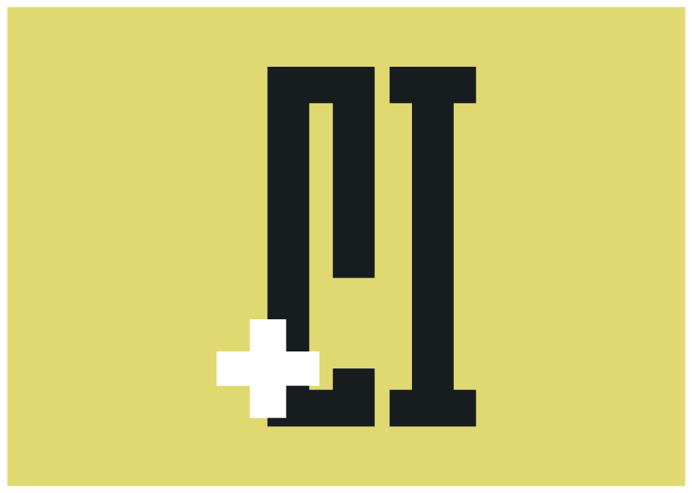

# MakineAI

<p align="center">
  
</p>

<p align="center">
  <strong>Türkçe Oyun Çeviri Platformu</strong>
</p>

<p align="center">
  <a href="#özellikler">Özellikler</a> •
  <a href="#kurulum">Kurulum</a> •
  <a href="#kullanım">Kullanım</a> •
  <a href="#geliştirme">Geliştirme</a> •
  <a href="#katkıda-bulunma">Katkıda Bulunma</a>
</p>

---

## Hakkında

MakineAI, Windows oyunlarını Türkçe'ye çevirmek için geliştirilmiş bir masaüstü uygulamasıdır. Oyunları otomatik tespit eder, çeviri paketlerini uygular ve oyun güncellemelerini takip eder.

## Özellikler

- **Otomatik Oyun Tespiti**: Steam, Epic Games ve GOG kütüphanelerini otomatik tarar
- **Çoklu Motor Desteği**: Unity, Unreal Engine, RPG Maker, Ren'Py, GameMaker
- **Akıllı Çeviri**: Translation Memory ve Glossary sistemi
- **Güvenli Yedekleme**: Oyun dosyalarını otomatik yedekler
- **Kolay Kullanım**: Tek tıkla çeviri uygulama

## Desteklenen Oyun Motorları

| Motor | Durum |
|-------|-------|
| Unity (Mono/IL2CPP) | ✅ Destekleniyor |
| Unreal Engine | ✅ Destekleniyor |
| RPG Maker MV/MZ | ✅ Destekleniyor |
| RPG Maker VX Ace | ✅ Destekleniyor |
| Ren'Py | ✅ Destekleniyor |
| GameMaker | ✅ Destekleniyor |
| Bethesda (Creation) | ✅ Destekleniyor |

## Sistem Gereksinimleri

- **İşletim Sistemi**: Windows 10/11 (64-bit)
- **RAM**: 4 GB minimum
- **Disk**: 500 MB (uygulama) + çeviri paketleri için alan

## Kurulum

### Son Sürümü İndir

[Releases](https://github.com/jlceaser/MakineAI/releases) sayfasından en son sürümü indirin.

### Kaynak Koddan Derleme

#### Gereksinimler

- Qt 6.8+ (MSVC)
- CMake 3.25+
- vcpkg
- Visual Studio 2022 (v143 toolset)
- [just](https://github.com/casey/just) (opsiyonel, build otomasyonu için)

#### Ortam Değişkenleri

```powershell
# vcpkg kurulu değilse
git clone https://github.com/Microsoft/vcpkg.git C:\vcpkg
C:\vcpkg\bootstrap-vcpkg.bat
setx VCPKG_ROOT "C:\vcpkg"

# Qt yolu
setx Qt6_DIR "C:\Qt\6.8.1\msvc2022_64"
```

#### Derleme (just ile - önerilen)

```powershell
# Bağımlılıkları yükle
just setup

# Her şeyi derle
just all

# Testleri çalıştır
just test

# Uygulamayı başlat
just run
```

#### Derleme (CMake Presets ile)

```powershell
# Core library
cmake --preset core-release
cmake --build --preset core-release

# QML uygulaması
cmake --preset qml-release
cmake --build --preset qml-release
```

#### Visual Studio ile

```powershell
# VS2022 solution oluştur
cmake --preset vs2022-qml

# VS'de aç
start build/vs2022-qml/MakineAI.sln
```

## Kullanım

1. Uygulamayı başlatın
2. Oyun kütüphaneleriniz otomatik taranacak
3. Çevirmek istediğiniz oyunu seçin
4. "Çevir" butonuna tıklayın
5. İşlem tamamlandığında oyunu başlatın

## Proje Yapısı

```
MakineAI/
├── core/           # C++ Core Library
│   ├── include/    # Public headers
│   ├── src/        # Implementation
│   └── tests/      # Unit tests
├── qml/            # Qt QML Application
│   ├── src/        # C++ backend
│   └── qml/        # QML UI files
├── assets/         # Shared assets
└── docs/           # Documentation
```

## Geliştirme

### Mimari

- **Core**: C++20/23, CMake, vcpkg
- **UI**: Qt6 QML
- **Platform**: Windows x64

### Build Modları

```bash
# UI-only mode (core bağımlılıkları olmadan)
cmake -B build -DMAKINEAI_UI_ONLY=ON

# Full build (core + UI)
cmake -B build

# Test build
cmake -B build -DBUILD_TESTING=ON
```

## Katkıda Bulunma

Katkılarınızı bekliyoruz! Lütfen:

1. Bu repoyu fork edin
2. Feature branch oluşturun (`git checkout -b feature/amazing-feature`)
3. Değişikliklerinizi commit edin (`git commit -m 'Add amazing feature'`)
4. Branch'inizi push edin (`git push origin feature/amazing-feature`)
5. Pull Request açın

## Lisans

Bu proje MIT lisansı altında lisanslanmıştır - detaylar için [LICENSE](LICENSE) dosyasına bakın.

## İletişim

- **Discord**: [MakineAI Community](https://discord.com/invite/QDezpy4QtV)
- **Website**: [makineai.com](https://makineai.com)
- **Twitter**: [@jlceaser](https://twitter.com/jlceaser)

---

<p align="center">
  Made with ❤️ by CEDRA Interactive
</p>
